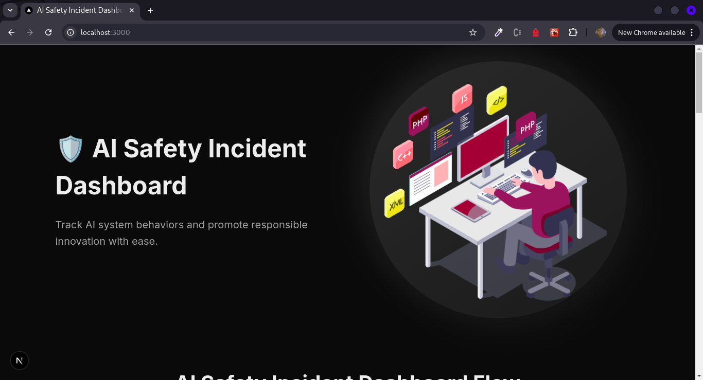
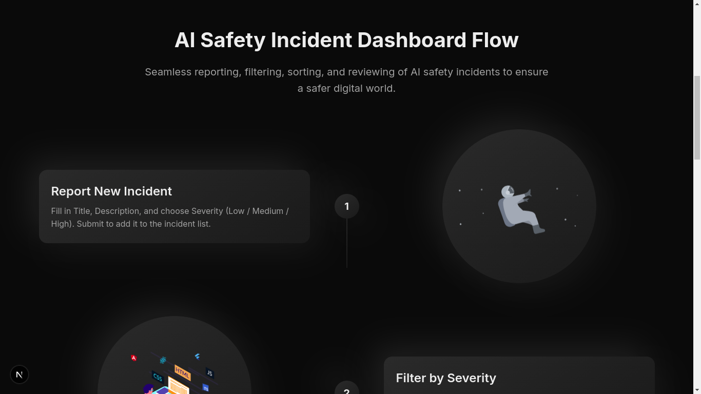
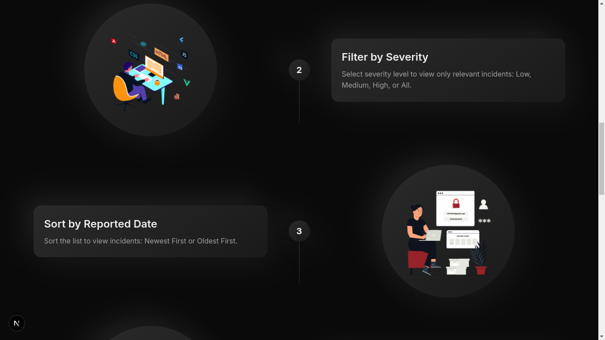
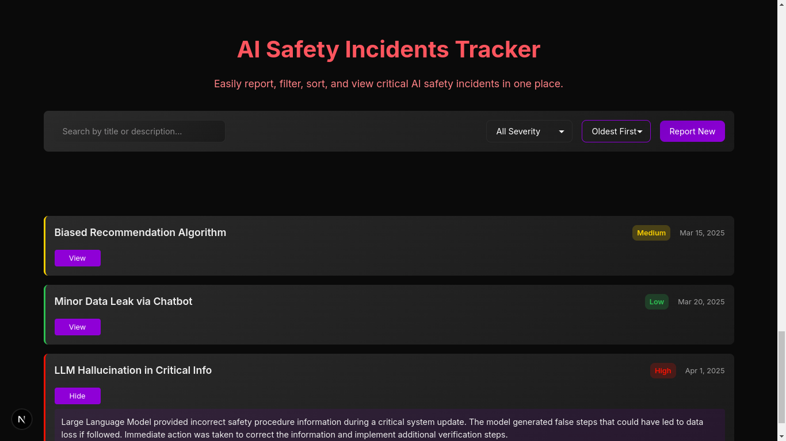
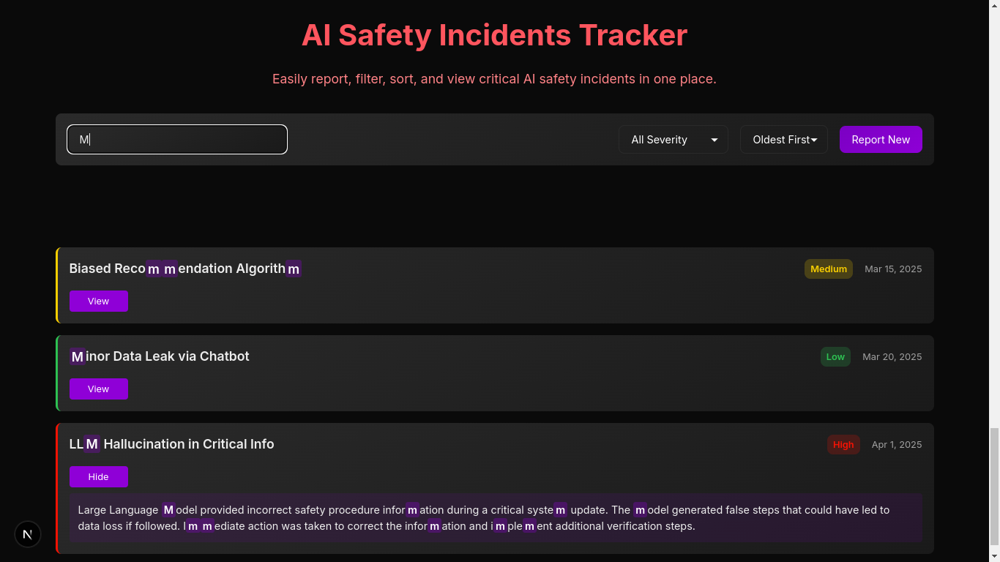

# AI Safety Incident Dashboard

A modern, responsive web application for tracking and managing AI safety incidents. Built with Next.js and React, featuring real-time incident reporting, filtering, and search capabilities.








## Features

- 📊 Real-time incident tracking and management
- 🔍 Advanced search with text highlighting
- 🎯 Filter incidents by severity (Low, Medium, High)
- 📅 Sort incidents by date (Newest/Oldest)
- 📱 Fully responsive design for all devices
- 🎨 Modern UI with smooth animations
- 📝 Easy incident reporting form

## Prerequisites

Before you begin, ensure you have the following installed:
- Node.js (v14 or later)
- npm or yarn
- Git

## Installation

1. Clone the repository:
```bash
git clone https://github.com/SumitGarg11/ai_safety.git
cd ai_safety
```

2. Install dependencies:
```bash
npm install
# or
yarn install
```

## Development

To run the development server:

```bash
npm run dev
# or
yarn dev
```

Open [http://localhost:3000](http://localhost:3000) in your browser to see the application.

## Project Structure

```
ai-safety-dashboard/
├── src/
│   ├── app/
│   │   ├── page.tsx          # Main application page
│   │   └── layout.tsx        # Root layout component
│   ├── components/
│   │   ├── FlowSection.jsx   # Step-by-step guide component
│   │   └── IncidentSection.jsx # Incident management component
│   └── styles/
│       └── globals.css       # Global styles
├── public/                   # Static assets
└── package.json             # Project dependencies
```

## Usage

### Reporting an Incident
1. Click the "Report New" button
2. Fill in the incident details:
   - Title
   - Description
   - Severity level
3. Click "Submit" to add the incident

### Managing Incidents
- Use the search bar to find specific incidents
- Filter incidents by severity using the dropdown
- Sort incidents by date using the "Newest First" dropdown
- Click "View" to see full incident details
- Click "Hide" to collapse the details

## Technology Stack

- **Framework**: Next.js with React
- **Styling**: CSS Modules
- **Reason for choice**:  
  I chose **Next.js** because I am comfortable with it, and it fits well with Sparklehood's technology stack.

